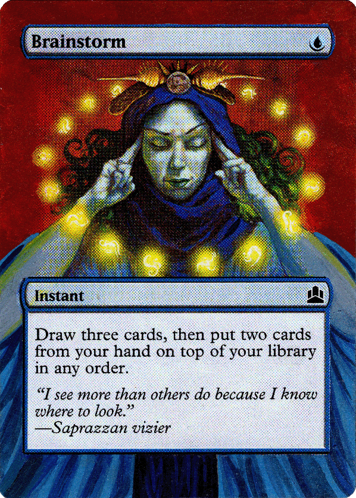

# Summary
Mox Galleria is a website that showcases Magic: The Gathering alters and signed cards from the personal collection of Andy Papa.

**Author: Andy Papa**  
**Created:** 04/26/2024 **Last Updated:** 04/27/2024

# "Brainstorm" Release


The "Brainstorm" release focuses on the minimum viable product (MVP) release of Mox Galleria. The release is named after my very first commissioned alters, a playset of Brainstorm from the Commander 2011 set by GK Alters.

**Planned Release Date:** TBD

# Background
The MTG alter and signed card community is a relatively small and niche community with an online presence in various subreddits, Discord channels, and Facebook groups. It is often cumbersome to post pictures of my collection in these online groups because posts are generally unorganized and can get burried over time due to the linear nature. I also feel alters and signed cards should have consistent, high quality scans rather than photos taken from mobile phones of varying quality. 

The goal is to create a website that showcases my personal collection in _one_ place with high quality scans and other useful card metadata.

# Glossary
- **Alter** - A collectibe trading card that has been artisitcally altered or customized by an artist, usually hand painted or hand drawn
- **Gatherer** - The official Magic: The Gathering card database hosted by Wizards of the Coast
- **MTG** - abbreviation for Magic: The Gathering
- **Playset** - 4 of the same card is colloquially known as a "playset". In Magic: The Gathering 60 card formats, players are only allowed 4 of the same card in decks. 
- **Scryfall** - A community run Magic: The Gathering search website with a powerful search syntax
- **Signed Card** - A collectible trading card that has been autographed by the original artist or other noteworthy person

# High-Level Requirements
More granular requirements such as use cases and user stories will be managed via a more robust tracking system such as Trello or Jira with a link to be provided at a later date.

## Functional Requirements
1. A user should be able to view the collection via various view styles including: Gallery view, List view, Magazine View.
2. A user that clicks on a an alter or signed card should be redirected to a detailed product page for the card.
3. The detailed product page for a card should contain: 
    - Additional photos if available
    - Card metadata (set, number, rarity, card text, original artist, etc)
    - Condition
    - Alter artist name
    - Who the card is signed by
    - If the card is available for trade or sale
    - Additional notes
4. Users should be able to search for cards via a search box.


## Non-Functional Requirements
1. Card metadata should be sourced from a reliable and trustworthy source such as Scryfall or Gatherer.

## Extended Requirements
1. Implement Scryfall search syntax
2. Implement search box autocomplete
3. Create an upload tool to easily upload new alters and signed cards

# High-Level Design
## Database and Schema Design
As it currently stands, the magnitude of my collection is less than 100, a rather trivial amount for any DBMS to store. In my lifetime, I do not forsee crossing a ceiling of single-digit _thousands_ of alters and signed cards (if I did, I would likely have bigger problems than showcasing my collection online).

For the sake of simplicity and speed, data will be stored in a structured JSON for each card on managed DynamoDB tables hosted on AWS.

Proposed DynamoDB Table Schema:

```
{
      "TableName": "mox_galleria_mtg_alters",
      "KeyAttributes": {
        "PartitionKey": {
          "AttributeName": "alter_id",
          "AttributeType": "N"
        }
      },
      "NonKeyAttributes": [
        {
          "AttributeName": "card_id",
          "AttributeType": "S"
        },
        {
          "AttributeName": "card_name",
          "AttributeType": "S"
        },
        {
          "AttributeName": "playset_id",
          "AttributeType": "N"
        },
        {
          "AttributeName": "alter_artist",
          "AttributeType": "S"
        },
        {
          "AttributeName": "signed_by",
          "AttributeType": "S"
        },
        {
          "AttributeName": "condition",
          "AttributeType": "S"
        },
        {
          "AttributeName": "additional_images",
          "AttributeType": "L"`
        },
        {
          "AttributeName": "notes",
          "AttributeType": "L"`
        }
      ]
}
```

Here is an example item of my very first commissioned Brainstorm alter:

```
{
    "alter_id": "018f27f1-6558-7d50-9287-c6223f74683c", // partition key
    "card_id": "beb755c1-9221-480e-bef9-73f1f13a3345",
    "card_name": "Brainstorm",
    "playset_id": "1",
    "alter_artist": "GK Alters",
    "signed_by": null,
    "condition": "LP",
    "status": "NOT_FOR_SALE_TRADE",
    "notes": [
      {
        "date": 1714600997,
        "content": "My very first commissioned alter"
      }
    ]
}
```

## Scryfall Data
Scryfall returns an exhaustive amount of data for every card in MTG's history. Again here is an example of what the Scryfall REST API returns for my very first commissioned alter, [Brainstorm from the Commander 2011 set](https://api.scryfall.com/cards/cmd/40/). 

Mox Galleria will integrate with its REST API as a trustworthy and authoratative source of card metadata.

Scryfall also conveniently host [bulk data files](https://scryfall.com/docs/api/bulk-data) of its _entire_ database. Considerations were made for hosting the entirety of MTG's card library locally, but is likely unnecessary; instead, coresponding Scryfall card metadata for each of the alters and signed cards will be inserted along with Mox Galleria data at _insertion time_.

Proposed DynamoDB Table Schema:
```
{
      "TableName": "mox_galleria_mtg_cards",
      "KeyAttributes": {
        "PartitionKey": {
          "AttributeName": "card_id",
          "AttributeType": "S"
        }
      },
      "NonKeyAttributes": [
        {
          "AttributeName": "provider",
          "AttributeType": "S"
        },
        {
          "AttributeName": "metadata",
          "AttributeType": "M"
        }
      ]
}
```

The entirety of Scryfall's metadata will be captured per card in order to maximize implementing Scryfall's keyword and expressions search syntax.

## Upload Tool
My current rate of acquiring alters and signed cards is about a playset every 1-2 months; this makes high-res scanning and manual insertion of data relatively manageble, including managing incrementing IDs and manually gathering Scryfall metadata. However, a web based tool, only accessible by an admin persona, would be much more convenient. 

For the sake of releasing the MVP, an upload tool and the write and update APIs to support it will be a stretch goal.

## APIs
```
POST /cards/mtg
body:
  card_id
  provider
  metadata

addMtgCard(card_id, provider, metadata)
```
_Adds a single card along with the metadata from a provider such as Scryfall_

Parameters:  
**card_id (UUID)** - unique identifier  
**provider (string)** - provider of metadata (i.e. Scryfall)  
**metadata (JSON)** - sourced card metadata from provider

```
GET /cards/mtg/{card_id}

getMtgCard(card_id)
```
_Returns a single MTG card based on a unique ID_

Parameters:
card_id (UUDI) - unique identifier

```
POST /alters/mtg/
body:
  alter_id
  card_id
  card_name
  playset_id
  alter_artist
  signed_by
  condition
  status

addMtgAlter(alter_id, card_id, card_name, playset_id, alter_artist, condition, status)
```
_Adds a single alter card_

Parameters:  
**alter_id (UUID)** - unique identifier  
**card_id (UUID)** - unique identifier, foreign key references mox_galleria_mtg_cards table  
**card_name (string)** - card's name  
**playset_id (number)** - ID of the playset the card belongs to  
**alter_artist (string)** - Name of the alter artist  
**signed_by (string)** - If signed, name of the notable person who autographed the card  
**condition (string - NM | LP | MP | HP | DMG)** - condition of the card using standard accepted notation  
**status (string - NOT_FOR_SALE_TRADE | FOR_SALE_TRADE | FOR_SALE | FOR_TRADE)** - status of the card if its for sale, for trade, or both.